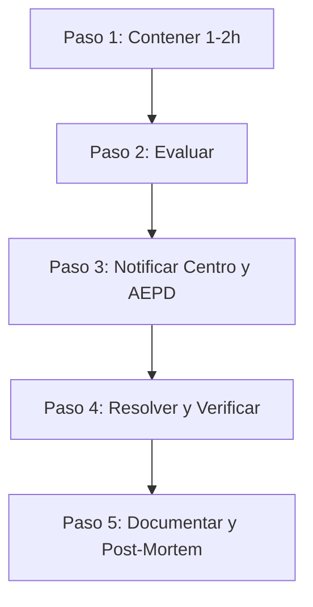

# 🛡️ Protocolo de Actuación ante Incidentes de Seguridad
**ScholaIA / AvisIA** — *Documento Interno Operativo*
*Fecha de actualización: Agosto 2026*

> [!IMPORTANT]
> **Documento interno para socios:** No es un texto legal para publicar; es una guía práctica para que el equipo sepa con total exactitud cómo proceder ante anomalías o brechas. Revisar periódicamente y actualizar al incorporar nuevos colegios.

---

## 1. ¿Qué se considera un Incidente?

Se catalogará como incidente de seguridad cualquier ocurrencia dentro de las siguientes casuísticas:
* **Fuga cruzada de datos (Multi-Tenant):** Un colegio visualiza datos, conversaciones, métricas o informes pertenecientes a otro centro.
* **Acceso no autorizado:** Intrusión o acceso al panel de control o servidores sin credenciales válidas.
* **Fuga de configuración (Prompt Leakage):** El bot expone su *system prompt*, directrices internas o variables de entorno.
* **Alucinaciones críticas o lenguaje inapropiado:** El bot emite respuestas falsas graves o lesivas de manera recurrente.
* **Indisponibilidad del servicio:** Caída total o intermitencia severa del asistente.
* **Corrupción o pérdida de datos:** Pérdida de integridad en registros de formularios o logs.
* **Ataque externo / Hackeo:** Sospecha fundada de vulnerabilidad explotada en VPS, bases de datos o API.
* **Brecha en proveedores:** Compromiso de seguridad en la infraestructura de hosting o de la API de IA (ej. Google Gemini).

### 🚦 Niveles de Gravedad
* 🟢 **Leve:** Afecta a la experiencia de usuario o velocidad de respuesta, sin comprometer datos personales (PII).
* 🟡 **Moderado:** Incidencia confinada a un solo centro educativo, sin exposición de datos a terceros.
* 🔴 **Grave:** Compromiso, fuga o cruce de datos personales (PII), o acceso indebido confirmado a la infraestructura.

---

## 2. Matriz de Roles y Responsabilidades

| Rol | Responsable | Cometido Principal |
| :--- | :--- | :--- |
| **Detección** | Persona a cargo de monitorización | Detecta la anomalía o recibe la alerta/notificación de incidencia. |
| **Decisión** | Socio 1 / Socio 2 | Clasifica la gravedad y autoriza el plan de contención inmediata. |
| **Técnico** | Responsable de infraestructura | Aplica el corte técnico, restauración de backups, aislamiento y parcheo. |
| **Comunicación** | Responsable de relación con colegios | Redacta y remite el comunicado oficial a la dirección del centro. |
| **Legal y Registro** | Responsable de cumplimiento RGPD | Documenta las evidencias técnicas, redacta el informe y tramita con la AEPD si procede. |

---

## 3. Protocolo de Actuación en 5 Pasos



### ⏱️ Paso 1 — Contener (Primeras 1-2 horas)
* Cortar accesos o pausar el bot del colegio afectado de inmediato si hay riesgo de fuga.
* **Prohibido borrar registros en caliente:** Conservar intactos los logs y evidencias forenses.

### 🔍 Paso 2 — Evaluar
* Determinar si existen datos personales afectados (PII) y el volumen estimado de personas/alumnos/familias.
* Identificar el vector: ¿fallo técnico de configuración o intrusión externa?
* Asignar nivel de severidad definitivo (🟢 / 🟡 / 🔴).

### 📢 Paso 3 — Notificar (Nivel Moderado y Grave)
* **Al Colegio Afectado:** Notificación inmediata con transparencia y sin tecnicismos excesivos (utilizar plantilla oficial).
* **A la AEPD (Agencia Española de Protección de Datos):** Notificación preceptiva antes de **72 horas** si el incidente entraña riesgo para los derechos y libertades de las personas (Art. 33 RGPD).

### 🛠️ Paso 4 — Resolver
* Desplegar la solución definitiva (parche de código, regeneración de API keys, restauración de snapshot/backup o aislamiento de base de datos).
* Comprobar la integridad del sistema antes de restablecer el servicio.

### 📝 Paso 5 — Revisar y Documentar
* Completar el informe post-mortem con causa raíz y medidas correctoras preventivas.
* Actualizar el presente protocolo si se detectan escenarios no previstos.

---

## 4. Plantillas Oficiales de Comunicación

### 📧 Plantilla de Aviso al Colegio Afectado
```text
Asunto: Aviso de incidencia de seguridad — [Nombre del Colegio]

Estimado/a [Director/a o Responsable del Centro],

Le informamos de que el [Fecha] hemos detectado [breve descripción del incidente, en lenguaje claro y sin tecnicismos].

• Datos afectados: [Tipología de datos / "Ningún dato identificativo de carácter personal"]
• Alcance: [Número estimado de personas o periodo temporal]
• Acciones inmediatas ejecutadas: [Medidas de contención técnica aplicadas]
• Próximos pasos: [Solución en curso y hora prevista de siguiente actualización]

Quedamos a su entera disposición para cualquier aclaración técnica o administrativa en [contacto@scholaia.es] / [Teléfono].

Atentamente,
[Nombre del Socio] — ScholaIA
```

### 📋 Plantilla de Registro Interno Post-Incidente
* **Fecha y hora del incidente:**
* **Fecha y hora de detección:**
* **Gravedad:** ( 🟢 Leve / 🟡 Moderado / 🔴 Grave )
* **Colegio(s) afectado(s):**
* **Descripción de los hechos:**
* **¿Cómo se detectó?:**
* **Datos afectados (PII):**
* **Notificación AEPD efectuada:** [ Sí / No / No procede ] — Fecha:
* **Notificación al Centro efectuada:** [ Sí / No ] — Fecha:
* **Causa Raíz:**
* **Solución Técnica Aplicada:**
* **Medidas Correctivas y Preventivas:**
* **Responsable del Seguimiento:**

---

## 5. Checklist de Mínimos Técnicos
- [x] Aislamiento multi-tenant validado por ID de colegio.
- [x] Copias de seguridad automáticas y programadas del VPS.
- [x] Registro de logs de acceso administrativo anonimizando PII (RGPD).
- [x] Rate limiting perimetral y escudo contra prompt injection implementados.
- [x] Protocolo de contingencia disponible y accesible para ambos socios.
